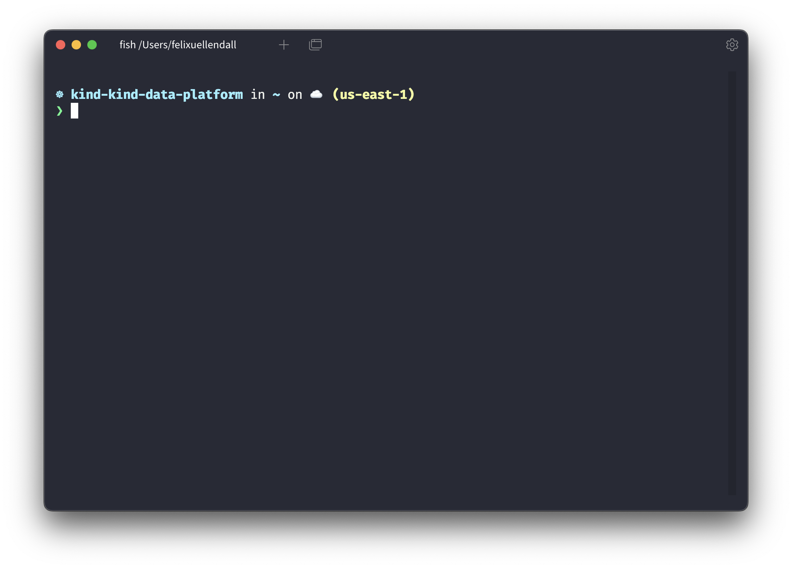

# tabby-theme-snazzy

> A snazzy theme for tabby (ex-terminus) 🤩

## How to install

1. Open tabby
2. Go to `Settings` then `Plugins`
3. Search for `theme-snazzy`, select it and click `Get`
4. Go to `Settings` then `Color scheme`
5. Search for `Snazzy` and select it
6. Restart tabby 🎉
